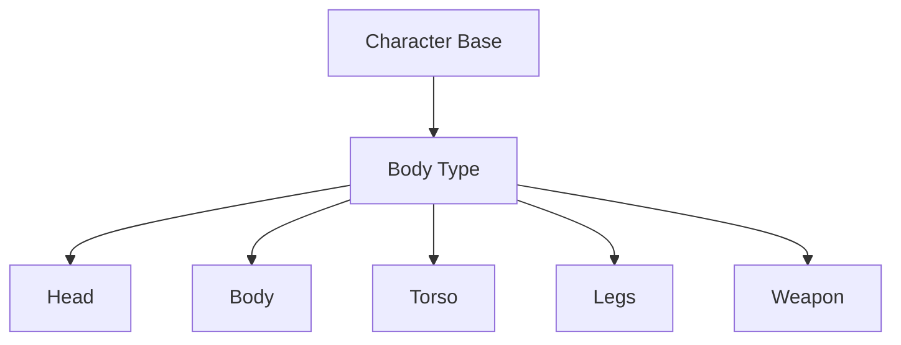

# RapidLPC - Godot LPC Character Generator  
 
[](https://opensource.org/licenses/MIT)

**A composable paper doll system for creating Liberated Pixel Cup (LPC) characters in Godot Engine**

[](https://www.youtube.com/watch?v=AdOoSin91mQ)

## Download Binary

[itch.io](https://etamity.itch.io/rapidlpc)

## Features

- 🧩 **Modular Body Part System**: Combine heads, bodies, clothing, and equipment
- 🎨 **Live Swapping**: Change character components in real-time
- 🧬 **LPC-Compatible**: Works with standard LPC spritesheets
- 🕹️ **Animation Ready**: Generated characters work with Godot's AnimationPlayer
- 📦 **Resource-Driven Design**: Easy to extend with new assets
- 🧪 **Proof of Concept**: Core functionality implemented (see Demo)

## Design Philosophy

This system follows a composable Entity-Component pattern:



## Key architectural principles:

- Modular Part Management

    Each body part autonomously handles its own textures and animations for clean separation of concerns.

- Real-Time Character Preview

    Instantly visualize character changes as you swap body parts.
- Live Animation Preview

    Test and preview animations dynamically during the design process.

- Intelligent Texture Layering

    Automatic z-index sorting ensures proper visual hierarchy of body layers.

- Flexible LPC Export Options

    Export as a single compact spritesheet or split animation sheets in standard Liberated Pixel Cup format.

## Getting Started
- Step 1: Download and Unzip Universal-LPC-Spritesheet-Character-Generator
- Step 2: Open RapidLPC
- Step 3: Click Open Spritesheets Folder
- Step 4: Select spritesheets folder in Universal-LPC-Spritesheet-Character-Generator
- Step 5: Start building/generating your own characters
- Step 6: Export spritesheets

### Prerequisites
- [GodotJS 4.4+](https://github.com/godotjs/GodotJS)
- [LPC Spritesheets](https://github.com/LiberatedPixelCup/Universal-LPC-Spritesheet-Character-Generator/tree/master/spritesheets)

### Installation
1. Clone repository:
   ```bash
   git clone https://github.com/etamity/rapidlpc.git
   ```
2. Open project folder in terminal
3. Run `godot -e`

## Contributing
Contributions are welcome! Please follow these guidelines:
1. Fork the repository
2. Create feature branch (`git checkout -b feature/export-spritesheets`)
3. Commit changes
4. Push to branch
5. Open pull request

Current priorities:
- [ ] Animation blending system
- [ ] Color tinting support
- [ ] More LPC base sets
- [ ] Export functionality

## License
Distributed under the MIT License. See `LICENSE` for more information.

## Acknowledgments
- [Universal-LPC-Spritesheet-Character-Generator](https://github.com/LiberatedPixelCup/Universal-LPC-Spritesheet-Character-Generator)
- [LPC](https://opengameart.org/content/lpc-character-generation) contributors
- [Godot Engine](https://godotengine.org/)
- [GodotJS](https://github.com/godotjs/GodotJS)